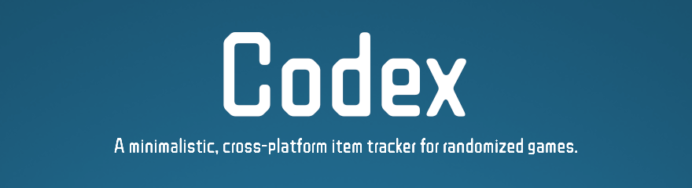

<!-- markdownlint-disable MD033 -->

  

# Codex

Codex is a minimalistic, cross-platform item tracker for randomized games. Built on React and Electron, it allows gamers on any operating system the ability to enjoy their favorite randomized games with ease.

# How to Install

Check the [releases tab](https://github.com/goyney/codex/releases) and download Codex for your operating system.

- **Windows**: The `exe` file will automatically install and launch Codex upon running it.
- **macOS**: Open the `dmg` file and drag Codex to your Applications folder.
- **Linux**: Make the `AppImage` file executable and run it.

# Supported Games

- [A Link to the Past Randomizer](https://alttpr.com/) (SNES)

# Adding New Games

There's a couple ways you can get a new game into Codex.

1. [Open an issue](https://github.com/goyney/codex/issues/new?labels=Game+Addition&template=1_game_addition.md&title=) requesting a game you'd like to see added.
2. Develop it yourself and open a PR.

## Developing New Game Trackers

To start developing, `yarn install` and then `yarn develop`.

Game tracker components are written in React, so an understanding of the React ecosystem is required to create new trackers. Game tracker components are located in the `src/renderer/components/Games` directory.

1. Create a new directory for a specific game (if one does not currently exist).
2. Develop your new item tracker component(s) for the game.
    - Any assets, such as custom `SCSS` files or `SVG` graphics specific to the game should be nested in the game directory.
3. Add a new entry in `src/renderer/components/Games/games.js` to register your item tracker(s).

There is a common `<Item/>` component that can be used that should fit most use cases. Game-specific components should remain scoped to the game.

# License

MIT

Game trademarks and copyrights are properties of their respective owners.
